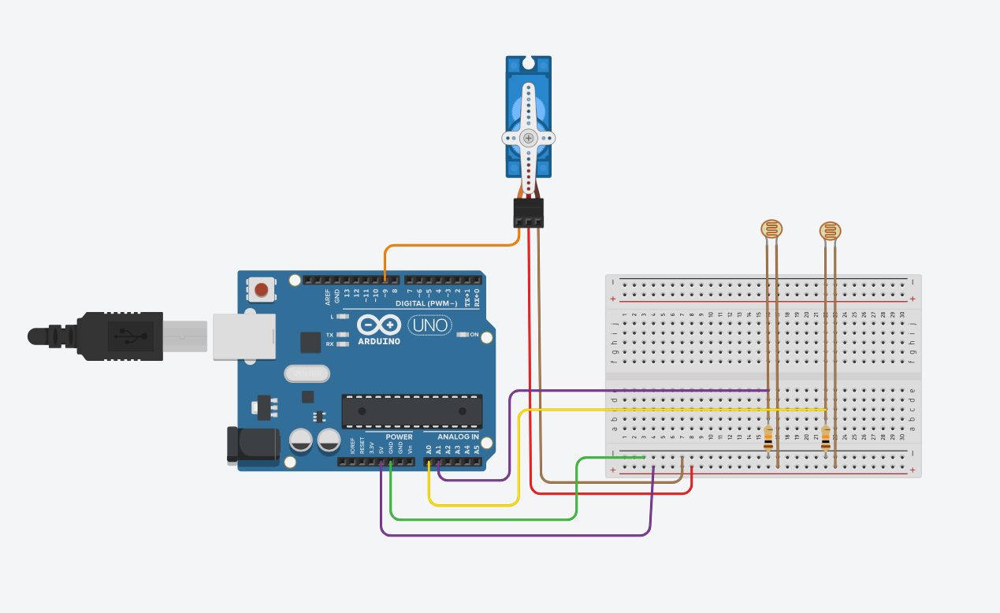

# ☀️ Arduino-Based Single-Axis Solar Tracker

<div align="center">

```
  ╔════════════════════════════════════════════════════════╗
  ║          🌅 SUNRISE       ☀️  MIDDAY          🌇 SUNSET          ║
  ║          Panel: /         Panel: |            Panel: \           ║
  ║          [=====/]         [=====|]            [=====\]           ║
  ║                                                                  ║
  ║                » The panel always chases the sun. «              ║
  ╚════════════════════════════════════════════════════════╝
```


**Skills demonstrated:**
`Embedded C++` · `Analog Sensing` · `PWM Control` · `Feedback Loop Design` · `Sensor Fusion` · `Rapid Prototyping`

</div>

---

## 🚨 The Problem

**Solar panels are dumb by default.**

A fixed solar panel is aimed at the sky and left there — permanently. But the sun doesn't cooperate. It rises in the east, arcs overhead, and sets in the west. A panel locked at a fixed angle is truly optimally aligned for perhaps **2–3 hours per day**, silently wasting potential energy the rest of the time.

Think of it like reading under a lamp and never shifting your book as the light moves. You'd just read in shadow and wonder why things seemed dim.

> 🌍 India receives some of the highest solar irradiance in the world — yet billions of kWh are left uncaptured every year simply because panels don't move. That's not an energy problem. That's an engineering problem.

The question this project set out to answer: *What if the panel could just... follow the sun?*

---

## 💼 Business Case

| Pain Point | Real-World Impact |
|-----------|-------------------|
| Fixed panels waste 25–35% of potential energy daily | Inflated electricity bills, slower payback on solar investment |
| Manual re-angling is impractical at any scale | High labor costs, inconsistency, human error |
| Rural & off-grid areas have no grid fallback | Energy scarcity stalls economic development |

### What this project delivers

A single-axis tracker costing under **₹1,200** with zero manual intervention can:

- **Boost energy yield by 30–40%** from the same panel — no new hardware, just smarter orientation
- **Extend peak generation** from ~6 hours (fixed) to ~10 hours (tracked) per day
- **Demonstrate fast ROI** — at scale, the cost of a tracker is recovered within weeks of operation
- **Enable agricultural use** — solar water pumps with trackers irrigate for longer, more reliably
- **Scale linearly** — the same feedback logic governs 1 panel or 10,000

This prototype proves the concept at minimal cost. The engineering insight scales to real infrastructure.

---

## 📌 Project Overview

A **self-built, fully functional prototype** of a single-axis solar tracker using an Arduino UNO, two LDR sensors, and a servo motor. The system continuously reads light intensity from both sides of the panel and autonomously rotates it toward the brighter direction — maintaining optimal sun alignment from **east to west** throughout the day.

This project demonstrates practical application of: analog sensor interfacing, real-time feedback control, PWM-based motor actuation, and low-cost embedded system design.

**Total component cost: under ₹1,200.**

---

## ⚙️ System Architecture

```
┌──────────────┐   analog (0–1023)   ┌──────────────────┐   PWM signal   ┌───────────────┐
│  LDR — East     │ ────────────────▶│                     │────────────▶│   SG90 Servo     │
│  [ A0 pin ]     │                     │     Arduino UNO     │                │                  │
├──────────────┤                     │                     │                │  Rotates panel   │
│  LDR — West     │ ──────── ───────▶│  Δ = East − West    │                │  from 0° → 180° │
│  [ A1 pin ]     │                     │  if Δ > threshold   │                │                  │
└──────────────┘                     │  → actuate servo    │                └──────────────┘
                                        └──────────────────┘
                                               ↑
                                     Sense → Compare → Actuate
                                       (loop every 100ms)
```

**Control Logic:**

1. Both LDRs read ambient light intensity as analog voltages via a **10kΩ voltage divider**.
2. Arduino computes the **difference** between east and west readings.
3. If the difference exceeds a deadband threshold → servo rotates toward the brighter side.
4. When both LDRs reach **equilibrium** → panel is sun-aligned and motion stops. ✅
5. The loop repeats continuously, adapting in real time to the sun's movement.

---

## 💻 Source Code

The core tracking logic runs a continuous feedback loop — read both LDRs, compare them, rotate the servo toward the brighter side, stop when balanced.

On startup, the servo initialises to **0° (East)** — pointing where the sun rises — so the panel is already in a sensible position at dawn without hunting for it:

```cpp
// Initialise facing East (sun rises here)
int angle = 0;
myServo.write(angle);  // 0° = East, 90° = Noon, 180° = West

// Core control loop (simplified)
int LDR1 = analogRead(A0);  // LDR facing East
int LDR2 = analogRead(A1);  // LDR facing West

if (LDR1 < LDR2) {
  angle = angle + 10;        // West is brighter → rotate West
  myServo.write(angle);
} else {
  angle = angle - 10;        // East is brighter → rotate East
  myServo.write(angle);
}
```

> 📁 Full source: [`src/solar_tracker.ino`](src/solar_tracker.ino)

---

## 🧰 Bill of Materials

| # | Component | Qty | Cost (INR) |
|---|-----------|:---:|------------|
| 1 | Arduino UNO | 1 | ₹249 |
| 2 | SG90 Servo Motor | 1 | ₹135 |
| 3 | LDR / Photoresistor | 2 | ₹15 each |
| 4 | 10kΩ Resistor | 2 | ₹2 each |
| 5 | Mini Breadboard | 1 | ₹65 |
| 6 | Small Solar Panel (5V) | 1 | ₹150 |
| 7 | Jumper Wires (set) | 1 | ₹50 |
| | | **Total** | **~₹680** |

---

## 🔌 Wiring Reference

### Tinkercad Simulation Circuit




| Component | Arduino Pin | Wiring Notes |
|-----------|:-----------:|-------------|
| LDR 1 — East | A0 | One leg → 5V; other leg → A0 + 10kΩ to GND |
| LDR 2 — West | A1 | One leg → 5V; other leg → A1 + 10kΩ to GND |
| Servo Signal | D9 (PWM) | Yellow / orange wire |
| Servo & LDR VCC | 5V | Red wire |
| Common GND | GND | Black wire |

> ⚠️ **Important:** The junction between each LDR and its 10kΩ resistor is what connects to the analog input pin. This voltage divider is what converts light intensity into a readable voltage — don't skip the resistors.

---

## 📊 Performance

| Configuration | Relative Daily Output |
|--------------|----------------------|
| Static Fixed Panel | 100% (baseline) |
| Single-Axis Tracker | **~130–140%** |
| Projected Dual-Axis | ~145–150% |

The tracker delivers the biggest gains at **sunrise and sunset**, when a fixed panel is nearly edge-on to the sun and losing the most energy. That's exactly when this system is working hardest.

---

## ✅ Advantages

- **+30–40% energy yield** with no panel upgrade — purely algorithmic and mechanical
- **Fully autonomous** operation — no manual adjustment ever needed
- **Sub-₹1,200** build cost — accessible, replicable, teachable
- **Extends peak generation** from ~6 hours to ~10 hours daily
- **Architecture scales** — same feedback logic works for 1 panel or an entire farm

---

## ⚠️ Limitations

- **Single-axis only** — tracks East–West, not seasonal altitude (North–South)
- **LDR sensitivity to diffuse light** — performance degrades on cloudy or overcast days
- **SG90 mechanical limits** — not rated for continuous operation or heavy panel loads
- **No weatherproofing** — current build is lab/prototype grade only
- **No data logging** — efficiency gain is estimated, not empirically measured yet

---

## 🚀 Roadmap

- [ ] **Dual-Axis Tracking** — second servo + 2 LDRs for altitude control → projected +10–15% additional gain
- [ ] **INA219 Power Sensor** — measure actual voltage & current output to quantify efficiency gain with real data
- [ ] **RTC-Based Fallback** — DS3231 module to estimate sun position by time when LDRs can't detect directional light (cloudy days)
- [ ] **SD Card Data Logger** — log timestamped power readings to measure performance over days/weeks
- [ ] **Weatherproof Enclosure** — 3D-printed housing for outdoor long-term deployment

---

## 💡 Ideas to Extend This Project

| Enhancement | Why It Matters | Difficulty |
|-------------|---------------|:----------:|
| 🖥️ **OLED Display** | Show LDR values, servo angle, and tracking status live on the device | 🟢 Easy |
| 🎮 **Manual Override Button** | Toggle between auto-track and manual servo control — great for demos | 🟢 Easy |
| 💡 **LED Efficiency Bar** | A row of LEDs that fills proportionally to efficiency gain — satisfying to watch | 🟢 Easy |
| 🔋 **Live Battery Charging** | Route panel output through a TP4056 module to charge a Li-ion cell — proves real energy is being stored | 🟡 Medium |
| ☁️ **Cloudy Day RTC Override** | If both LDRs read below a threshold, switch to clock-based sun positioning | 🟡 Medium |
| 🌡️ **Thermal Tilt Protection** | DHT11 sensor triggers a slight panel tilt when temperature exceeds a safe threshold | 🟡 Medium |
| 📱 **Wi-Fi Dashboard** | ESP8266 add-on + Blynk app for remote monitoring and control from a phone | 🟡 Medium |
| 🤖 **Predictive ML Positioning** | Train a lightweight model on historical irradiance data to pre-position the panel before sunrise | 🔴 Advanced |

---

## 🧠 What I Learned

This project taught me far more than I expected for something built on a breadboard.

**On the hardware side**, I learned how voltage dividers actually behave in the real world — not just on paper. Getting stable analog readings from LDRs required understanding noise, adding a software deadband, and tuning the threshold so the servo didn't twitch constantly. That jitter problem burned more time than I'd like to admit.

**On the firmware side**, I learned that clean, well-commented embedded code isn't optional — it's the difference between a project you can debug at 2 AM and one you abandon. Renaming vague variables like `x` and `val` to `eastVal` and `delta` sounds trivial, but it made the logic readable at a glance.

**On the systems level**, I genuinely didn't expect the tracker to perform as noticeably as it did. Watching the panel smoothly pivot to follow a flashlight was one of those moments where you realize: *this is why feedback control systems exist.* The "sense → compare → actuate" loop is deceptively simple, yet it underlies everything from thermostats to autopilots.

**What I'd do differently:**
- Add an INA219 sensor from day one to log real power data — the 30–40% efficiency claim is well-documented, but measuring it myself would have made the project far more compelling
- Use a stepper motor instead of a servo for better precision and positional memory across power cycles
- Build the enclosure first, then fit the electronics — retrofitting a breadboard prototype into a case is a lesson in patience

The most valuable takeaway: **hardware debugging is humbling.** A loose jumper wire can waste an hour. Now I label everything.

---

## 🗂️ Repository Structure

```
📦 arduino-solar-tracker
 ┣ 📁 src/
 ┃ ┗ 📄 solar_tracker.ino       ← main firmware
 ┣ 📁 docs/
 ┃ ┗ 📄 presentation.pptx       ← project presentation
 ┗ 📄 README.md
```

---

## 📄 License

Open-source under the [MIT License](LICENSE). Build it, improve it, ship it — just drop a star if it helped. ⭐

---

<div align="center">

```
       ☀️ ──────────────────────────────── ☀️
      rise                                 set
              [panel followed it all day]
```

*Built with curiosity, a ₹500 microcontroller, and more Serial.println() calls than I'll ever admit.*

</div>
